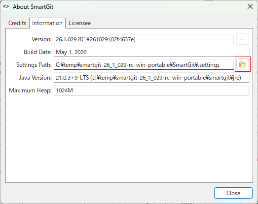

# About smartgit.properties

`smartgit.properties` is a configuration file located in the SmartGit settings directory.
Normally, this file stores Low-level Properties settings, but the following special options are provided for developers and translators.
Note that the specifications of these options may change for internal reasons.

| #  | Key | Type | Default | Description |
|----|-----|------|---------|-------------|
| 1  | smartgit.i18n | string | - | Create this entry and specify a locale identifier to enable translator mode. Set it to `false` to temporarily disable it.<br> Examples of valid values: `false`, `zh_CN`, `ja_JP`, `ru_RU` |
| 2  | smartgit.debug.i18n.development | string | - | Specify the path to the directory containing the PO/POT files. The translation file corresponding to the locale identifier set in `smartgit.i18n` is loaded from this directory. Example: `ja_JP.po`|
| 3  | smartgit.debug.i18n.markTranslatable | boolean | false | A specific mark will be displayed at the beginning of the translation for translatable UI elements not yet included in `messages.pot`. |
| 4  | smartgit.debug.i18n.markUntranslated | boolean | false | A specific mark will be displayed at the beginning of the translation for UI elements that are included in `messages.pot` but have not yet been translated. |
| 5  | smartgit.debug.i18n.markerTranslatable | string | ✨ | Specifies the character to be displayed when `i18n.markTranslatable` is true in option 3. |
| 6  | smartgit.debug.i18n.markerUntranslated | string | ■ | Specifies the character to be displayed when `i18n.markUntranslated` is true in option 4. |

Despite setting options 5 and 6, strings that remain in English on the GUI are currently untranslatable and require modifications to the SmartGit source code to become translatable.
If you want such strings to be made translatable, please create an issue with a screenshot of the relevant location.


Note that the file path specified for option 2 must use `/` as the path separator, even on Windows. Also, `:` must be escaped with `\`.
For example, `c:\dir1\dir2` becomes `c\:/dir1/dir2`.

Complete configuration example:

```smartgit.properties
smartgit.i18n=ja_JP
smartgit.debug.i18n.development=C\:/temp/smartgit-translations/po
smartgit.debug.i18n.markTranslatable=true
smartgit.debug.i18n.markUntranslated=true
smartgit.debug.i18n.markerTranslatable=✨
smartgit.debug.i18n.markerUntranslated=■

```

## Location of smartgit.properties

If you do not know where `smartgit.properties` is located, you can check the settings directory from the SmartGit UI.

1. Select `Help` -> `About SmartGit` from the menu.


2. Open the `Information` tab and check the directory shown in `Settings Path`. The `smartgit.properties` file is stored in this directory.


